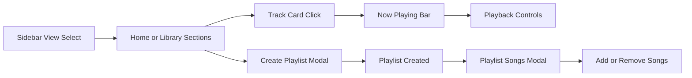

# Music Maniac

<p align="center">
  
</p>

<p align="center">
  A professional React + TypeScript music player with polished UI, responsive layout, theme switching, playlist management, and rich playback controls.
</p>

<p align="center">
  <a href="#overview">Overview</a> |
  <a href="#feature-set">Feature Set</a> |
  <a href="#tech-stack">Tech Stack</a> |
  <a href="#quick-start">Quick Start</a> |
  <a href="#project-structure">Project Structure</a> |
  <a href="#contributing">Contributing</a>
</p>

<p align="center">
  
  
  
  
</p>

## Overview

Music Maniac is a single-page web music player designed for a production-quality user experience:

- responsive desktop and mobile-first layout
- collapsible sidebar with adaptive navigation behavior
- dark and light themes with animated transitions
- now-playing controls with seek, volume, repeat, shuffle, and like actions
- custom playlist creation, plus add/remove songs from playlists
- persistent app state using `localStorage`

## Feature Set

| Area | Highlights |
| --- | --- |
| Playback | play/pause, next/previous, seek, volume, mute, repeat, shuffle |
| Navigation | sidebar views: home, library, playlists, favorites, recent |
| Playlists | create playlists, open playlist editor, add/remove tracks |
| UX polish | glass surfaces, transitions, responsive controls, keyboard shortcuts |
| Personalization | dark/light mode, liked songs, recent history, saved preferences |
| SEO/PWA basics | robots, sitemap, webmanifest, themed logo/favicon assets |

## UI Flow



## Tech Stack

- React 18
- TypeScript
- Vite 6
- Tailwind CSS 4
- Lucide React
- HTML5 Audio APIs

## Quick Start

### Prerequisites

- Node.js 18+
- npm 9+

### Install

```bash
npm install
```

### Run locally

```bash
npm run dev
```

Default local URL:

```txt
http://localhost:5173
```

### Lint and build

```bash
npm run lint
npm run build
npm run preview
```

## Available Scripts

| Script | Description |
| --- | --- |
| `npm run dev` | Starts Vite development server |
| `npm run build` | Runs TypeScript compile and production build |
| `npm run preview` | Serves production build locally |
| `npm run lint` | Lints TypeScript/React code with ESLint |

## Project Structure

```txt
src/
  components/
    CreatePlaylistModal/
    Dashboard/
    Header/
    HomeView/
    NowPlaying/
    NowPlayingBar/
    PlaylistSongsModal/
    Sidebar/
    TrackCard/
  context/
    MusicPlayerContext.tsx
  data/
    musicLibrary.ts
  hooks/
    useAudioPlayer.ts
    usePlaylist.ts
  utils/
    helpers.ts
public/
  mm-logo.png
  mm-logo-themed.png
  mm-logo.svg
  music/
```

## Data Source

Track catalog is defined in:

- `src/data/musicLibrary.ts`

Audio files are stored in:

- `public/music/`

## Accessibility and UX Notes

- reduced motion is respected for theme transition behavior
- keyboard shortcuts are supported for playback controls
- responsive layouts are optimized for small touch devices

## Contributing

Contribution guidelines are in [CONTRIBUTING.md](./CONTRIBUTING.md).

## License

This project is licensed under the MIT License. See [LICENSE](./LICENSE).
