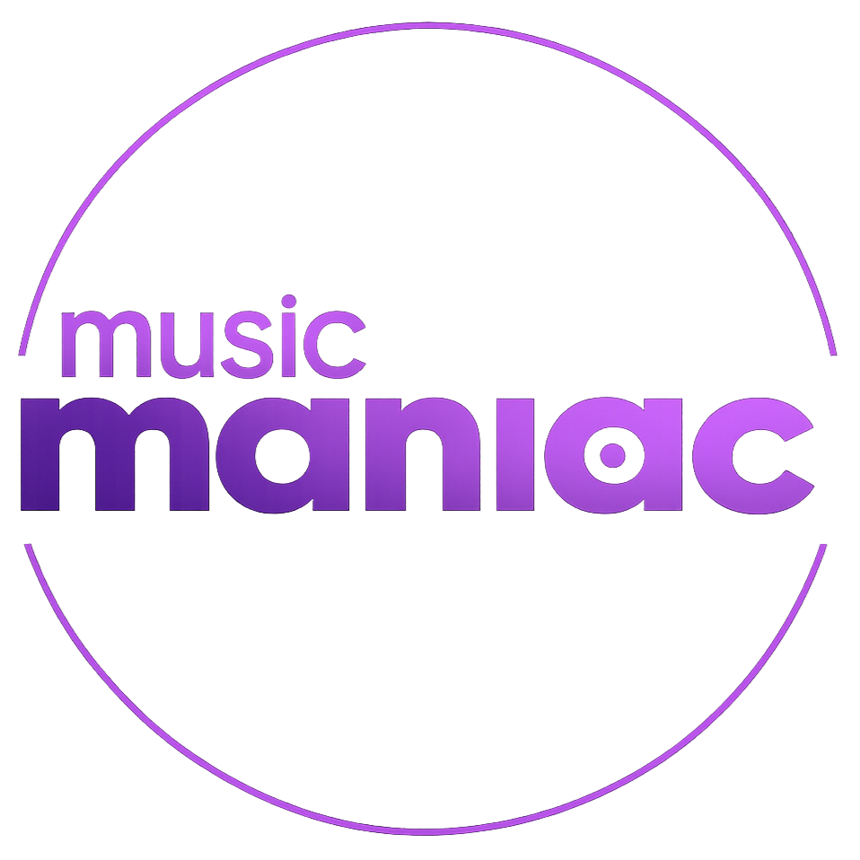

# 🎵 Music Maniac

<p align="center">
  
</p>

<p align="center">
  <strong>Experience the future of music streaming with our premium, glassmorphic music player!</strong>
</p>

<p align="center">
  <a href="#features">Features</a> •
  <a href="#tech-stack">Tech Stack</a> •
  <a href="#installation">Installation</a> •
  <a href="#usage">Usage</a> •
  <a href="#contributing">Contributing</a>
</p>

---

## 🌟 Overview

**Music Maniac** is a cutting-edge, professional-grade music streaming application built with modern web technologies. Featuring a stunning glassmorphic UI, advanced audio controls, and seamless mobile responsiveness, it delivers an unparalleled listening experience. Whether you're a casual listener or an audiophile, Music Maniac brings your music to life with premium design and powerful features.

## ✨ Features

### 🎮 Advanced Player Controls
- **Play/Pause & Skip**: Smooth playback with intuitive controls
- **Shuffle & Repeat**: Customize your listening experience
- **Progress Seeking**: Precise track navigation with visual feedback
- **Volume Control**: Fine-tuned audio adjustment with mute toggle
- **Now Playing Bar**: Persistent controls at the bottom for easy access

### 🎨 Premium UI/UX
- **Glassmorphic Design**: Sleek, translucent interface with backdrop blur
- **Dynamic Gradients**: Ever-changing backgrounds that adapt to your music
- **Responsive Layout**: Perfect on desktop, tablet, and mobile devices
- **Dark Theme**: Eye-friendly design optimized for extended listening
- **Smooth Animations**: Fluid transitions and hover effects throughout

### 📱 Mobile-First Experience
- **Touch-Optimized**: Large, accessible controls for mobile users
- **Drawer Navigation**: Elegant sidebar that slides in on mobile
- **Adaptive Sizing**: Elements scale beautifully across all screen sizes
- **Gesture Support**: Intuitive touch interactions

### 🔍 Smart Features
- **Real-Time Search**: Find songs, artists, and albums instantly
- **Playlist Management**: Create and organize your music collections
- **Library Views**: Browse by Home, Library, Playlists, Favorites, and Recent
- **Track Information**: Detailed metadata display with album art

### 🚀 Performance & SEO
- **Lightning Fast**: Built with Vite for instant loading
- **SEO Optimized**: Comprehensive meta tags and structured data
- **PWA Ready**: Installable as a progressive web app
- **Accessibility**: ARIA labels and semantic HTML for all users

## 🛠️ Tech Stack

- **Frontend**: React 18 with TypeScript
- **Styling**: Tailwind CSS with custom glassmorphic classes
- **Build Tool**: Vite for fast development and optimized builds
- **Icons**: Lucide React for consistent, scalable icons
- **Audio**: HTML5 Audio API with advanced controls
- **Deployment**: Vercel-ready with SEO and PWA support

## 🚀 Installation

### Prerequisites
- Node.js (v16 or higher)
- npm or yarn

### Quick Start

1. **Clone the repository**
   ```bash
   git clone https://github.com/yourusername/music-maniac.git
   cd music-maniac
   ```

2. **Install dependencies**
   ```bash
   npm install
   ```

3. **Start the development server**
   ```bash
   npm run dev
   ```

4. **Open your browser**
   Navigate to `http://localhost:5173` to experience Music Maniac!

### Build for Production
```bash
npm run build
npm run preview
```

## 📖 Usage

### Getting Started
1. **Launch the App**: Open Music Maniac in your browser
2. **Explore Music**: Browse the pre-loaded library or add your own tracks
3. **Play Music**: Click any track to start playing
4. **Navigate**: Use the sidebar to switch between views (Home, Library, etc.)
5. **Search**: Use the top search bar to find specific songs or artists

### Mobile Usage
- **Menu Button**: Tap the hamburger menu to open the navigation drawer
- **Touch Controls**: All player controls are optimized for touch
- **Responsive Design**: Enjoy the same experience on any device

### Adding Your Music
To add custom tracks, update the `musicLibrary.ts` file in the `src/data/` directory:

```typescript
{
  id: 'your-track-id',
  name: 'Song Title',
  artist: 'Artist Name',
  album: 'Album Name',
  duration: '3:45',
  albumArt: 'path/to/album/art.jpg',
  audioSrc: 'path/to/audio/file.mp3'
}
```

## 📸 Screenshots

### Desktop View


### Mobile View


### Now Playing


## 🎵 Current Playlist

Music Maniac comes pre-loaded with an amazing collection:

1. **Banda** - Pritam, Diljit Dosanjh
2. **Chal** - Various Artists
3. **Chandni** - Ali Sethi
4. **Dil** - Various Artists
5. **Dilb** - Arijit Singh
6. **Ishq** - Various Artists
7. **Jhumka** - Bijay Anand Sahu
8. **Jiya** - Arijit Singh
9. **Kismat** - Bhagwan Dada
10. **Lutt** - Pritam, Arijit Singh
11. **Main** - Vishal Mishra
12. **Mitti** - Suresh Wadkar
13. **Nikle** - Pritam, Sonu Nigam
14. **O** - Pritam, Arijit Singh
15. **Saajan** - Darshan Raval
16. **Vande** - Vishal Dadlani
17. **Waheguru** - Shekhar Ravjiani

## 🤝 Contributing

We love contributions! Here's how you can help:

1. **Fork** the repository
2. **Create** a feature branch (`git checkout -b feature/amazing-feature`)
3. **Commit** your changes (`git commit -m 'Add amazing feature'`)
4. **Push** to the branch (`git push origin feature/amazing-feature`)
5. **Open** a Pull Request

### Development Guidelines
- Follow TypeScript best practices
- Maintain mobile responsiveness
- Add tests for new features
- Update documentation as needed

## 📄 License

This project is licensed under the MIT License - see the [LICENSE](LICENSE) file for details.

## 🙏 Acknowledgments

- Built with ❤️ using React and TypeScript
- Inspired by modern music streaming platforms
- Special thanks to the open-source community

---

<p align="center">
  <strong>🎵 Ready to revolutionize your music experience? Start streaming with Music Maniac today! 🎵</strong>
</p>

<p align="center">
  <a href="#music-maniac">Back to Top</a>
</p>
- CSS Grid and Flexbox for layout
- Custom styled range sliders
- Smooth transitions and hover effects
- Rotating animations for album art
- Gradient background generation
- Mobile-responsive design

- CSS Grid and Flexbox for layout
- Custom styled range sliders
- Smooth transitions and hover effects
- Rotating animations for album art
- Gradient background generation
- Mobile-responsive design

## 🎯 How to Use

1. **Starting the Player**: Open the application and click the play button
2. **Changing Songs**: Use the forward/backward buttons or let songs play automatically
3. **Random Mode**: Click the shuffle icon to enable random playback
4. **Volume Control**: Use the volume slider on the right
5. **Seeking**: Click anywhere on the progress bar to jump to that position
6. **Repeat**: Click the repeat icon to loop the current song

## 🎵 Adding Your Own Music

To add your own songs:

1. Add your audio files (MP3 format recommended) to the `music/` folder
2. Update the `music_list` array in `script.js`:

```javascript
{
    img: 'path/to/album/art.jpg',
    name: 'Song Title',
    artist: 'Artist Name',
    music: 'music/your-song.mp3'
}
```

## 🎨 Customization

### Changing Colors
- Modify the gradient colors in the `random_bg_color()` function
- Update the CSS variables for consistent theming

### Styling Updates
- Edit `style.css` to customize the appearance
- Modify button styles, fonts, and layout as needed

### Adding Features
- Extend the JavaScript functionality in `script.js`
- Add new controls or display elements in `index.html`

## 📱 Browser Compatibility

- ✅ Chrome (Latest)
- ✅ Firefox (Latest)
- ✅ Safari (Latest)
- ✅ Edge (Latest)
- ✅ Mobile browsers (iOS Safari, Chrome Mobile)

## 🤝 Contributing

1. Fork the repository
2. Create a feature branch (`git checkout -b feature/amazing-feature`)
3. Commit your changes (`git commit -m 'Add some amazing feature'`)
4. Push to the branch (`git push origin feature/amazing-feature`)
5. Open a Pull Request

## 📝 License

This project is open source and available under the [MIT License](LICENSE).

## 🎵 Current Playlist

The player comes with these pre-loaded tracks:
1. **Lutt Putt Gaya** - Pritam, Arijit Singh (Dunki)
2. **Nikle The Kabhi Hum Ghar Se** - Pritam, Sonu Nigam (Dunki)
3. **Banda** - Pritam, Diljit Dosanjh (Dunki)
4. **O Maahi** - Pritam, Arijit Singh (Dunki)
5. **Main Tera Rasta Dekhunga** - Pritam, Vishal Mishra
6. **Waheguru** - Shekhar Ravjiani
7. **Mitti** - Suresh Wadkar (Fighter)
8. **Vande Mataram** - Vishal Dadlani (Fighter)
9. **Dil Chah Raha Hai** - Vishal Mishra & Shilpa Rao
10. **Saajan Ve** - Darshan Raval
11. **Chandni Raat** - Ali Sethi
12. **Jhumka** - Bijay Anand Sahu
13. **Jiya Tui Chara** - Arijit Singh
14. **Quismat ki hawa** - Bhagwan Dada
15. **Dil Banaane Waaleya** - Arijit Singh

## 🎸 Screenshots

### Main Player Interface


## 🔧 Troubleshooting

**Audio not playing?**
- Ensure audio files are in the correct format (MP3 recommended)
- Check that file paths in `script.js` match your audio files
- Verify browser audio permissions

**Styling issues?**
- Clear browser cache and reload
- Check console for CSS/JS errors
- Ensure Font Awesome CDN is loading properly

## 📞 Support

If you encounter any issues or have questions:
- Open an issue on GitHub
- Check the browser console for error messages
- Ensure all files are properly linked

---

**Enjoy your music!** 🎵✨
